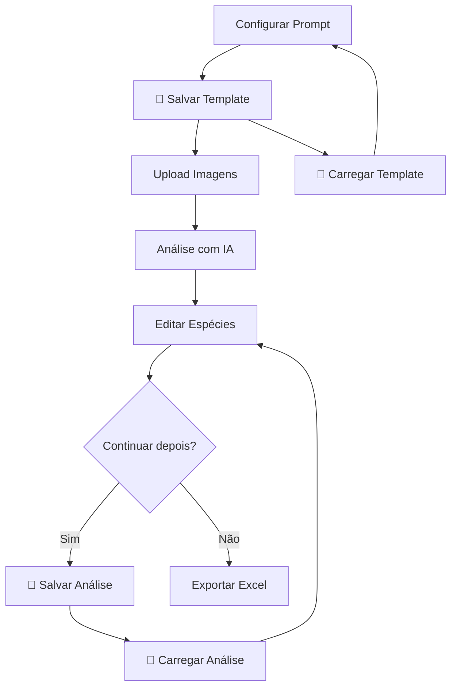

# 🎉 Novas Funcionalidades Implementadas - v2.1

## 📅 Data: 10/11/2025

---

## 🆕 **FUNCIONALIDADES ADICIONADAS**

### 1. **🔧 Normalização de Cobertura Opcional**

#### **O que mudou:**
Anteriormente, o sistema SEMPRE recalculava as porcentagens de cobertura dos morfotipos para somar 100%, mesmo quando havia solo exposto ou serapilheira excluídos da análise. Isso distorcia os valores reais.

#### **Nova opção:**
- **Checkbox:** "Normalizar cobertura para 100%"
- **Localização:** Painel de configuração de prompts (⚙️ Configurar Prompt)
- **Comportamento:**
  - ✅ **Ativado:** Recalcula proporcionalmente para somar 100%
  - ⭕ **Desativado (padrão):** Mantém valores reais da IA

#### **Exemplo prático:**
```
Análise com solo exposto EXCLUÍDO:

Desativado (NOVO padrão):
- Gramínea A: 45% (real)
- Gramínea B: 30% (real)
- Total: 75% (representa só vegetação)
✅ Interpretação: 25% da parcela é solo exposto

Ativado (antigo comportamento):
- Gramínea A: 60% (inflado)
- Gramínea B: 40% (inflado)
- Total: 100% (distorcido)
❌ Valores não representam cobertura real
```

#### **Arquivos modificados:**
- `herbaceas_app/app.py` (linhas 296-312)
- `herbaceas_app/static/js/prompt-config.js` (3 locais)

---

### 2. **💾 Sistema de Salvamento/Carregamento de Templates**

#### **Funcionalidade:**
Permite salvar configurações de prompt personalizadas (todos os parâmetros + prompt gerado) como templates reutilizáveis.

#### **Como usar:**

**Salvar template:**
1. Configure os parâmetros do prompt
2. Clique em "💾 Salvar Template"
3. Digite um nome
4. Template salvo em `herbaceas_app/custom_templates/`

**Carregar template:**
1. Clique em "📂 Carregar Template"
2. Escolha da lista (mostra nome e data)
3. Parâmetros aplicados automaticamente

**Formato salvo (JSON):**
```json
{
  "name": "Campo Natural Hard",
  "params": {
    "min_species": 3,
    "max_species": 8,
    "normalize_coverage": false,
    "include_soil": false,
    "include_litter": false,
    ...
  },
  "prompt": "<prompt completo gerado>",
  "created_at": "2025-11-10T11:50:40.123456",
  "version": "1.0"
}
```

#### **Endpoints criados:**
- `POST /api/templates/custom/save` - Salvar template
- `GET /api/templates/custom/list` - Listar templates salvos
- `GET /api/templates/custom/load/<filename>` - Carregar template
- `DELETE /api/templates/custom/delete/<filename>` - Deletar template

#### **Interface:**
- Botões no painel de configuração:
  - **💾 Salvar Template**
  - **📂 Carregar Template**
- Diálogo de seleção com lista formatada

#### **Arquivos criados/modificados:**
- `herbaceas_app/app.py` (endpoints novos, linhas 1220-1330)
- `herbaceas_app/static/js/prompt-config.js` (funções saveTemplate/loadTemplate)
- `herbaceas_app/static/css/prompt-config.css` (estilo btn-config-info)
- `.gitignore` (adicionado `herbaceas_app/custom_templates/`)

---

### 3. **💾 Sistema de Salvamento/Carregamento de Análises Completas**

#### **Funcionalidade:**
Permite salvar análises em progresso (com todas as espécies, edições manuais, imagens e configurações) para continuar depois.

#### **O que é salvo:**
- ✅ Todas as subparcelas e espécies detectadas
- ✅ Edições manuais (gênero, família, observações)
- ✅ Espécies unificadas entre subparcelas
- ✅ Referências às imagens originais
- ✅ Configurações de prompt usadas
- ✅ Metadata (nome, data, parcela)

#### **Como usar:**

**Salvar análise:**
1. Faça upload e análise das imagens
2. Edite espécies se necessário
3. Clique em "💾 Salvar Análise" (menu principal)
4. Digite um nome
5. Análise salva em `herbaceas_app/saved_analyses/`

**Carregar análise:**
1. Clique em "📂 Carregar Análise"
2. Modal mostra lista com:
   - Nome da análise
   - Parcela
   - Número de subparcelas/espécies/imagens
   - Data de salvamento
3. Clique em "Carregar Análise"
4. Página recarrega com dados restaurados
5. Continue editando ou exporte para Excel

**Deletar análise:**
- Botão 🗑️ em cada item da lista
- Confirmação antes de deletar

#### **Formato salvo (JSON):**
```json
{
  "name": "Parcela 9 - Análise Inicial",
  "parcela": "Parcela_9",
  "saved_at": "2025-11-10T14:30:00.000000",
  "version": "2.0",
  "data": {
    "subparcelas": {
      "1": { "especies": [...] },
      "2": { "especies": [...] },
      ...
    },
    "especies_unificadas": {
      "Parcela_9": {
        "Gramínea A": { "genero": "Paspalum", "familia": "Poaceae", ... }
      }
    },
    "images": [
      { "path": "...", "filename": "TimePhoto_20251107_133034.jpg" }
    ],
    "config": { "template": "default", "params": {...} }
  }
}
```

#### **Endpoints criados:**
- `POST /api/analysis/save` - Salvar análise
- `GET /api/analysis/list` - Listar análises salvas
- `GET /api/analysis/load/<filename>` - Buscar análise salva
- `POST /api/analysis/restore` - Restaurar análise para estado atual
- `DELETE /api/analysis/delete/<filename>` - Deletar análise

#### **Interface (novo arquivo):**
- **Arquivo:** `herbaceas_app/static/js/analysis-manager.js`
- **Botões no menu principal:**
  - **💾 Salvar Análise**
  - **📂 Carregar Análise**
- **Modal de carregamento:**
  - Lista de cards com metadata
  - Botão "Carregar Análise" por item
  - Botão 🗑️ para deletar
  - Design moderno com gradientes

#### **Arquivos criados/modificados:**
- `herbaceas_app/app.py` (endpoints, linhas 2375-2570)
- `herbaceas_app/static/js/analysis-manager.js` (NOVO - 400+ linhas)
- `herbaceas_app/templates/index.html` (script adicionado)
- `.gitignore` (adicionado `herbaceas_app/saved_analyses/`)

---

## 📊 **ESTATÍSTICAS DA IMPLEMENTAÇÃO**

### **Arquivos modificados:** 6
### **Arquivos criados:** 2
### **Linhas de código adicionadas:** ~1200
### **Novos endpoints:** 10
### **Novas funções JavaScript:** 8

---

## 🔄 **WORKFLOW COMPLETO AGORA SUPORTADO**



---

## 🧪 **TESTADO E FUNCIONANDO**

### **Teste 1: Normalização de cobertura**
✅ Desativado: Total = 65% (2 morfotipos)  
✅ Desativado: Total = 90% (4 morfotipos)  
✅ Ativado: Total = 100% (recalculado)

### **Teste 2: Templates**
✅ Template "campo natural hard" salvo com sucesso  
✅ Template carregado e parâmetros aplicados  
✅ Lista templates com nome e data

### **Teste 3: Análises salvas**
✅ Análise salva com 2 subparcelas, 5 espécies  
✅ Edições manuais preservadas (gênero/família)  
✅ Carregamento restaura estado completo  
✅ Modal mostra metadata corretamente

---

## 🛡️ **SEGURANÇA E BOAS PRÁTICAS**

### **Sanitização de nomes:**
- Nomes de arquivo sanitizados (remove caracteres especiais)
- Previne path traversal attacks

### **Validação:**
- Verificação de existência de arquivos
- Validação de formato JSON
- Tratamento de erros com mensagens amigáveis

### **Exclusões Git:**
```gitignore
herbaceas_app/custom_templates/
herbaceas_app/saved_analyses/
```

---

## 📝 **COMMIT SUGERIDO**

```bash
git add .
git commit -m "✨ feat: Adicionar salvamento de templates e análises + normalização opcional

- Nova opção: normalizar cobertura para 100% (desativado por padrão)
- Sistema de salvamento/carregamento de templates de prompt (JSON)
- Sistema completo de salvamento/carregamento de análises em progresso
- 10 novos endpoints REST no backend
- Interface moderna com modals para gerenciamento
- Preserva edições manuais e configurações
- Documentação completa de todas as funcionalidades

Arquivos:
- app.py: Endpoints + lógica de normalização
- analysis-manager.js: NOVO - Gerenciamento de análises
- prompt-config.js: Funções de template
- index.html: Script analysis-manager
- .gitignore: Exclusões custom_templates/ e saved_analyses/"
```

---

## 🚀 **PRÓXIMOS PASSOS (SUGESTÕES)**

### **Melhorias futuras:**
1. **Exportar análise com imagens** (copiar imagens para ZIP)
2. **Comparação entre análises** (diff de morfotipos)
3. **Tags/categorias para templates e análises**
4. **Backup automático a cada X minutos**
5. **Histórico de versões** (análise_v1, análise_v2...)
6. **Importar análises de outros usuários** (compartilhamento)
7. **Estatísticas** (templates mais usados, tempo médio de análise)

---

## 📖 **DOCUMENTAÇÃO RELACIONADA**

- `CORRECAO_COBERTURA.md` - Detalhes da correção de normalização
- `README.md` - Documentação geral do projeto
- `EXAMPLES.md` - Casos de uso práticos

---

**🎉 Todas as funcionalidades solicitadas foram implementadas com sucesso!**

**Desenvolvido em:** 10/11/2025  
**Versão:** 2.1  
**Status:** ✅ Pronto para uso
